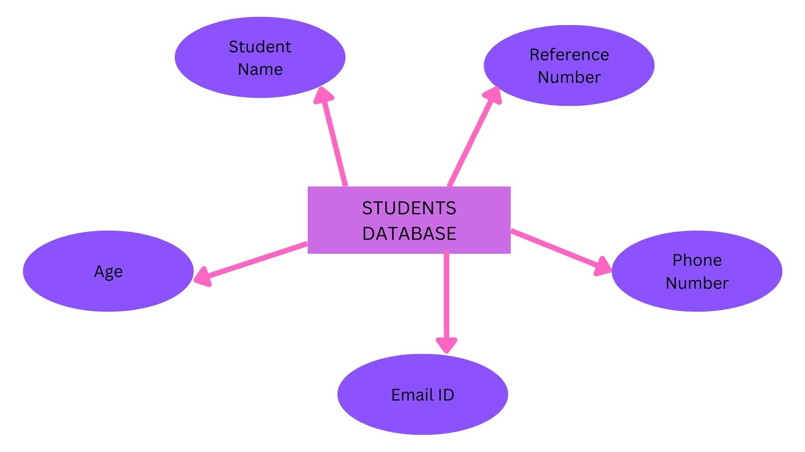
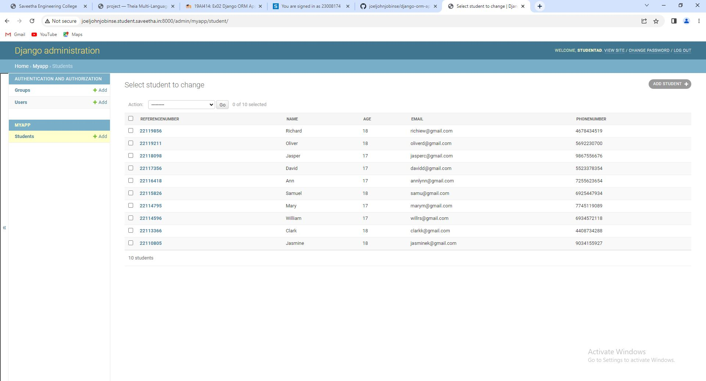
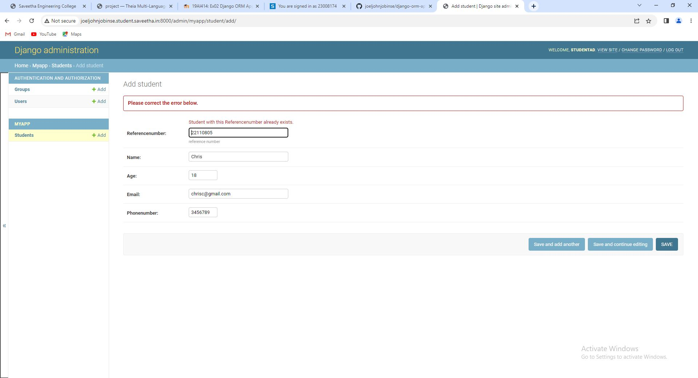

# Django ORM Web Application

## AIM
To develop a Django application to store and retrieve data from a database using Object Relational Mapping(ORM).

## Entity Relationship Diagram



## DESIGN STEPS

### STEP 1: Create folder 'ex02' under the directory 'unit2'

### STEP 2: Clone the GitHub repository into the directory 'ex02' using the command "git clone <url>"

### STEP 3: Under the folder "django-orm-app", enter the directory titled "dataproject" and enter the folder "dataproject" and go to the file "settings.py". Under the file, type "import os" in line 14, set ALLOWED_HOSTS=['*'] and add 'myapp' under the list INSTALLED_APPS.

### STEP 4: Return to the parent folder "dataproject" and install the application myapp using the command "python3 manage.py startapp myapp"

### STEP 5: Under the directory "myapp", open "models.py" and enter the code for the column headings

### STEP 6: Under the directory "myapp", open "admin.py" and enter the code to set up the admin

### STEP 7: Return to the parent folder "dataproject", and into the prompt, enter the command "python3 manage.py makemigrations"

### STEP 8: Into the prompt, enter the command "python3 manage.py migrate"

### STEP 9: Create a superuser by typing the command "python3 manage.py createsuperuser" into the prompt. Enter the username, leave the email address blank, and enter the password twice to create it.

### STEP 10: Into the prompt, type the command "python3 manage.py runserver 0:8000" to run the server at port number 8000 

### STEP 11: Open the admin login page and enter the username and password to login

### STEP 12: Under the "MYAPP" section, click on "Add" next to "Students" to create a record. Create 10 records in the same way.

### STEP 13: Once the records are made, take a screenshot and save it.

### STEP 14: Upload the screenshot into the "dataproject" directory by right-clicking on it and selecting "Upload Files"

### STEP 15: Once exited from the server, type the codes necessary for pushing the files into the GitHub repository.

## PROGRAM

### models.py:
```py
from django.db import models

from django.contrib import admin
# Create your models here.

class Student(models.Model):
    referencenumber=models.CharField(primary_key=True,max_length=8,help_text="reference number")
    name=models.CharField(max_length=100)
    age=models.IntegerField()
    email=models.EmailField()
    phonenumber=models.IntegerField()

class StudentAdmin(admin.ModelAdmin):
    list_display=('referencenumber','name','age','email', 'phonenumber')
```

### admin.py:
```py
from django.contrib import admin

from .models import Student, StudentAdmin
# Register your models here.
admin.site.register(Student, StudentAdmin)
```

## OUTPUT

### Student List:



### Error:



## RESULT:
The program is executed successfully.
